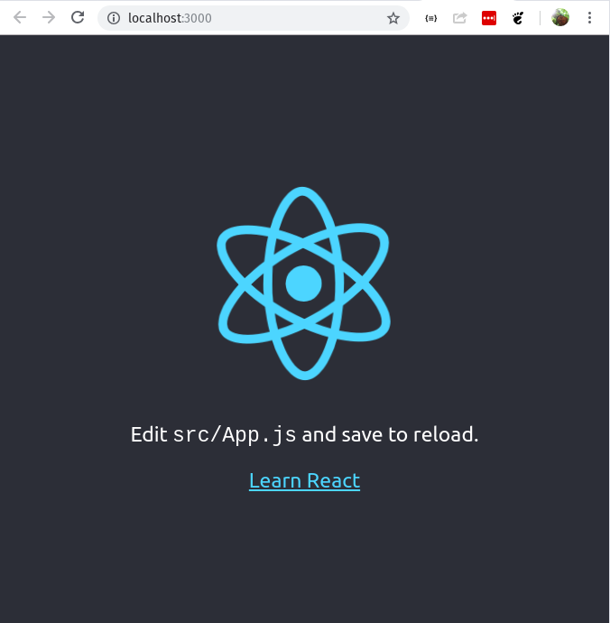

# Keep in mind
Originally, this repo was solely based off of the post: [Part 1 - React - Redux for Lazy Developers](https://hackernoon.com/react-redux-for-lazy-developers-b551f16a456f).

But, some of the stuff within in the post didn't seem right and it seemed to be a sales pitch for the author's redux library. 

So, I turned my attention away from that post and kept digging. 

As oppose to creating several other repos, I just continued compiling my notes within this repo.

I may change the name of this repo, I may not. :smile:

# React - Redux for lazy developers

Working with redux within a react app can be time consuming.

Action types, action creators, reducers and so on require a lot of hand holding.

A majority of actions are in fact CRUD and intended to work with redux store.

# Create React App
There are two options when getting started. Either use [`create-react-app`](https://github.com/facebook/create-react-app) or configure webpack with babel.

For this exercise we will use `create-react-app`.

**Note:** No reason to install `create-react-app` globally when we have `npx` available.

**Note:** We're going to create an alias and we're not going to use [hyphens](https://unix.stackexchange.com/questions/168221/are-there-problems-with-hyphens-in-functions-aliases-and-executables).
```
alias create_react_app='npx create-react-app'
create_react_app react-redux-example
```

# Npm Task List
The [`ntl`](https://www.npmjs.com/package/ntl) node package provides an interactive cli menu to list and run tasks.
```
alias ntl='npx ntl'
cd react-redux-example
ntl
```

After running `ntl` we will see `start`, `build`, `test`, `eject` commands:

* `start` — starts our app,
* `build` — builds static files (js, css…) to deploy it on server,
* `test` — runs tests of our app,
* `eject` — creates webpack config (after running eject command you’ll need to manage webpack by yourself).

Select `start` after running `ntl`.



To get started, we'll need to edit `src/App.js` and save to reload.

# App Structure
This post is super helpful: [The 100% correct way to structure a react app or why there's no such thing](https://hackernoon.com/the-100-correct-way-to-structure-a-react-app-or-why-theres-no-such-thing-3ede534ef1ed).
                           
We need to research the app structure and add redux.

```
sudo apt install tree
```

# Goals
1. Create stateful component by extending React.Component
2. See what is controlled components
3. See what is state and how to manage it
4. Split our component: get stateless components and smart container
5. See what is HOC and check other tools for working with state (recompose)

# Add lint-staged, prettier, husky, and eslint
Don't be that lazy... add them.

Add the following to `scripts` within `package.json`.

```
"lint": "eslint src",
"format": "npm run prettier -- --write",
"prettier": "prettier \"**/*.+(js|jsx|json|yml|yaml|css|less|scss|ts|tsx|md|graphql|mdx)\"",
"validate": "npm run lint && npm run prettier -- --list-different",
"precommit": "lint-staged"
```

Install `eslint`, `prettier`, `husky`, `lint-staged`, and etc...

```
npm i babel-eslint eslint eslint-config-prettier husky lint-staged prettier --save-dev
```

Important files
* `.eslintrc`
* `.lintstagedrc`
* `.prettierignore`
* `.prettierrc`

# jsx
Read [introducing jsx](https://reactjs.org/docs/introducing-jsx.html).
Then read [so long jsx](https://github.com/facebook/create-react-app/issues/87#issuecomment-234627904).

# First Form
Create a new directory `src/form` as an `index.js` file.

```
mkdir src/form
touch src/form/index.jsx
```
Update index.jsx
```jsx
import React, { Component } from 'react';

class App extends Component {
    render() {
        return (
            <form>
                <h1>Our form example</h1>
                <div>
                    <textarea />
                </div>
                <div>
                    <input type="submit" value="Submit" />
                </div>
            </form>
        );
    }
}

export default App;
```

Update `src/App.js` so that it imports the form and uses it.

# How can we get the entered text?
State! Let's update our component and make it smart... wow! This is not a good tutorial! Lol, he did say he was lazy...

We want to use jsx and we want to use formik instead.

# Formik
```
npm install formik --save
```

# CSS Modules
Read [this](https://blog.pusher.com/css-modules-react/)

# Styled components
```
npm install --save styled-components
```

Read [formik and styled components](https://medium.com/teamsubchannel/react-formik-styled-components-add78b37971f).

When you’re importing an existing component, you want to put it in parenthesis. :)
```jsx
const Input = styled(Field)``;
```

# File Naming
Name your file the same as the thing you’re exporting from that file.

This makes it easier to identify the file within your editor as opposed to having a bunch of tabs that say index.js or style.css.

# React Scoreboard
* Passing in outside values into a React component
* Binding click handler
* Constructor and super to make `this` available
* `setState` method

# Webpack
* Dev server - bundle and recompile

# Add some more dependencies
```
npm i debug ejs express morgan --save
```

# Add some more dev dependencies
```
npm i axios babel-core babel-loader babel-preset-env babel-preset-es2015 babel-preset-react concurrently lodash.debounce prop-types webpack --save-dev
```

# Helpful Links
* No bueno! [Part 1](https://hackernoon.com/react-redux-for-lazy-developers-b551f16a456f)
* [Hyphens: No Guarantee](https://unix.stackexchange.com/questions/168221/are-there-problems-with-hyphens-in-functions-aliases-and-executables)
* [8 npm tricks](https://medium.freecodecamp.org/8-npm-tricks-you-can-use-to-impress-your-colleagues-dbdae1ef5f9e)
* [Introducing jsx](https://reactjs.org/docs/introducing-jsx.html)
* [So long jsx](https://github.com/facebook/create-react-app/issues/87#issuecomment-234627904)
* [formik](https://jaredpalmer.com/formik/docs/overview)
* [The 100% correct way to structure a react app or why there's no such thing](https://hackernoon.com/the-100-correct-way-to-structure-a-react-app-or-why-theres-no-such-thing-3ede534ef1ed)
* [CSS modules](https://blog.pusher.com/css-modules-react/)
* [Formik and styled components](https://medium.com/teamsubchannel/react-formik-styled-components-add78b37971f)
* [Getting started with styled components](https://medium.com/styled-components/styled-components-getting-started-c9818acbcbbd)
* [Formik and Redux](https://github.com/jaredpalmer/formik/issues/265)
* [React Redux Axios Tutorial](https://appdividend.com/2018/06/15/react-redux-axios-tutorial-example)
* [Redux Glossary](https://github.com/reduxjs/redux/blob/master/docs/Glossary.md)